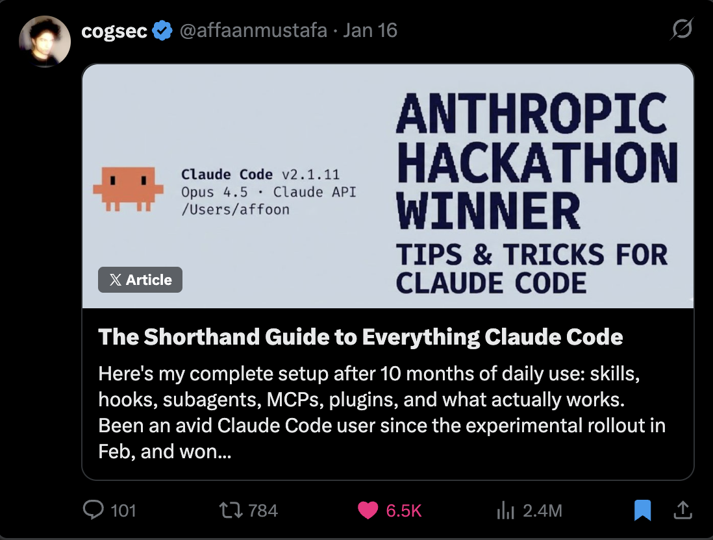

# Claude Code 完整指南


***

> **前提条件**：本指南建立在 [Claude Code 简明指南](the-shortform-guide.md) 之上。如果你尚未设置技能、钩子、子代理、MCP 和插件，请先阅读该指南。


*简明指南 - 请先阅读*

在简明指南中，我介绍了基础设置：技能与命令、钩子、子代理、MCP、插件，以及构成有效 Claude Code 工作流骨干的配置模式。那是设置指南和基础架构。

这份完整指南则深入探讨那些区分高效会话与浪费会话的技巧。如果你还没读过简明指南，请先回去设置好你的配置。以下内容假设你已经配置好技能、代理、钩子和 MCP，并且它们能正常工作。

这里的主题是：令牌经济学、记忆持久化、验证模式、并行化策略，以及构建可复用工作流带来的复合效应。这些是我在超过 10 个月的日常使用中提炼出的模式，它们决定了你是在第一个小时内就饱受上下文腐化之苦，还是能维持数小时的高效会话。

简明指南和完整指南中涵盖的所有内容都可以在 GitHub 上找到：`github.com/affaan-m/everything-claude-code`

***

## 技巧与窍门

### 某些 MCP 是可替代的，能释放你的上下文窗口

对于版本控制（GitHub）、数据库（Supabase）、部署（Vercel, Railway）等 MCP 来说——这些平台大多已有强大的 CLI，MCP 本质上只是对其进行了封装。MCP 是个不错的封装器，但它是有代价的。

要让 CLI 的功能更像 MCP，而无需实际使用 MCP（以及随之而来的上下文窗口减少），可以考虑将功能打包成技能和命令。剥离 MCP 暴露的那些让事情变简单的工具，并把它们变成命令。

示例：与其始终加载 GitHub MCP，不如创建一个 `/gh-pr` 命令来封装 `gh pr create` 并附带你偏好的选项。与其让 Supabase MCP 消耗上下文，不如创建直接使用 Supabase CLI 的技能。

有了惰性加载，上下文窗口的问题基本解决了。但令牌使用量和成本问题并未以同样的方式解决。CLI + 技能的方法仍然是一种令牌优化手段。

***

## 重要事项

### 上下文与记忆管理

要在会话间共享记忆，最好的方法是创建一个技能或命令，用于总结和检查进度，然后保存到 `.claude` 文件夹中的 `.tmp` 文件，并在会话结束前不断追加内容。第二天，它可以将其用作上下文并从中断处继续，为每个会话创建一个新文件，以免旧上下文污染新工作。


*会话存储示例 -> <https://github.com/affaan-m/everything-claude-code/tree/main/examples/sessions>*

Claude 创建一个总结当前状态的文件。审阅它，如果需要就要求编辑，然后重新开始。对于新的对话，只需提供文件路径。这在当你达到上下文限制并需要继续复杂工作时特别有用。这些文件应包含：

* 哪些方法有效（有证据可验证）
* 哪些方法尝试过但无效
* 哪些方法尚未尝试，以及还有哪些待办事项

**策略性地清除上下文：**

一旦你制定了计划并清除了上下文（Claude Code 计划模式现在的默认选项），你就可以根据计划工作。这在积累了大量与执行不再相关的探索性上下文时很有用。要进行策略性压缩，请禁用自动压缩。在逻辑间隔手动压缩，或创建一个为你执行此操作的技能。

**高级：动态系统提示注入**

我学到的一种模式是：与其把所有内容都放在 CLAUDE.md（用户范围）或 `.claude/rules/`（项目范围）中（这些会在每次会话加载），不如使用 CLI 标志动态注入上下文。

```bash
claude --system-prompt "$(cat memory.md)"
```

这让你能更精确地控制何时加载哪些上下文。系统提示内容比用户消息具有更高的权威性，而用户消息又比工具结果具有更高的权威性。

**实际设置：**

```bash
# Daily development
alias claude-dev='claude --system-prompt "$(cat ~/.claude/contexts/dev.md)"'

# PR review mode
alias claude-review='claude --system-prompt "$(cat ~/.claude/contexts/review.md)"'

# Research/exploration mode
alias claude-research='claude --system-prompt "$(cat ~/.claude/contexts/research.md)"'
```

**高级：记忆持久化钩子**

有一些大多数人不知道的钩子有助于记忆管理：

* **PreCompact 钩子**：在上下文压缩发生之前，将重要状态保存到文件
* **Stop 钩子（会话结束）**：在会话结束时，将学习成果持久化到文件
* **SessionStart 钩子**：在新会话开始时，自动加载之前的上下文

我已经构建了这些钩子，它们位于仓库的 `github.com/affaan-m/everything-claude-code/tree/main/hooks/memory-persistence`

***

### 持续学习 / 记忆

如果你不得不重复一个提示多次，并且 Claude 遇到了同样的问题或给出了你以前听过的回答——这些模式必须被追加到技能中。

**问题：** 浪费令牌、浪费上下文、浪费时间。

**解决方案：** 当 Claude Code 发现一些非琐碎的内容时——一个调试技巧、一个变通方法、一些项目特定的模式——它会将该知识保存为一个新技能。下次出现类似问题时，该技能会自动加载。

我构建了一个实现此功能的持续学习技能：`github.com/affaan-m/everything-claude-code/tree/main/skills/continuous-learning`

**为什么用 Stop 钩子（而不是 UserPromptSubmit）：**

关键的设计决策是使用 **Stop 钩子** 而不是 UserPromptSubmit。UserPromptSubmit 在每个消息上运行——给每个提示增加延迟。Stop 在会话结束时只运行一次——轻量级，不会在会话期间拖慢你的速度。

***

### 令牌优化

**主要策略：子代理架构**

优化你使用的工具和子代理架构，旨在将任务委托给足以胜任的最廉价模型。

**模型选择快速参考：**


*各种常见任务上子代理的假设设置及选择理由*

| 任务类型                 | 模型  | 原因                                        |
| ------------------------- | ------ | ------------------------------------------ |
| 探索/搜索                 | Haiku  | 快速、廉价，足以查找文件                     |
| 简单编辑                  | Haiku  | 单文件更改，指令清晰                         |
| 多文件实现                | Sonnet | 编码的最佳平衡点                             |
| 复杂架构                  | Opus   | 需要深度推理                                 |
| PR 审查                   | Sonnet | 理解上下文，能捕捉细微差别                     |
| 安全分析                  | Opus   | 不能错过漏洞                                 |
| 编写文档                  | Haiku  | 结构简单                                     |
| 调试复杂错误              | Opus   | 需要将整个系统记在脑中                         |

对于 90% 的编码任务，默认使用 Sonnet。当首次尝试失败、任务涉及 5 个以上文件、需要架构决策或编写安全关键代码时，升级到 Opus。

**定价参考：**


*来源：<https://platform.claude.com/docs/en/about-claude/pricing>*

**工具特定优化：**

用 mgrep 替换 grep——与传统 grep 或 ripgrep 相比，平均减少约 50% 的令牌：


*在我们的 50 项任务基准测试中，mgrep + Claude Code 使用的令牌比基于 grep 的工作流少约 2 倍，且判断质量相似或更好。来源：mgrep by @mixedbread-ai*

**模块化代码库的好处：**

拥有一个更模块化的代码库，主文件只有几百行而不是几千行，这有助于优化令牌成本，并提高任务首次尝试的成功率。

***

### 验证循环与评估

**基准测试工作流：**

比较在有技能和无技能的情况下要求同一件事，并检查输出差异：

分叉对话，在其中一个中不使用技能启动新的工作树，最后拉取差异，查看记录了什么。

**评估模式类型：**

* **基于检查点的评估**：设置明确的检查点，根据定义的标准进行验证，在继续之前修复问题
* **持续评估**：每 N 分钟或在重大更改后运行，运行完整的测试套件 + 代码检查

**关键指标：**

```
pass@k: 至少 k 次尝试中有一次成功
        k=1: 70%  k=3: 91%  k=5: 97%

pass^k: 所有 k 次尝试都必须成功
        k=1: 70%  k=3: 34%  k=5: 17%
```

当你只需要它能工作时，使用 **pass@k**。当一致性至关重要时，使用 **pass^k**。

***

## 并行化

在多 Claude 终端设置中分叉对话时，请确保分叉中的操作和原始对话的操作范围定义明确。在代码更改方面，力求最小化重叠。

**我偏好的模式：**

主聊天用于代码更改，分叉用于询问代码库及其当前状态，或研究外部服务。

**关于任意终端数量：**


*Boris (Anthropic) 关于运行多个 Claude 实例的讨论*

Boris 有一些关于并行化的建议。他曾建议在本地运行 5 个 Claude 实例，在云端运行 5 个。我建议不要设置任意的终端数量。增加终端应该出于真正的必要性。

你的目标应该是：**用最小可行的并行化程度，你能完成多少工作。**

**用于并行实例的 Git 工作树：**

```bash
# Create worktrees for parallel work
git worktree add ../project-feature-a feature-a
git worktree add ../project-feature-b feature-b
git worktree add ../project-refactor refactor-branch

# Each worktree gets its own Claude instance
cd ../project-feature-a && claude
```

如果你要开始扩展实例数量，并且有多个 Claude 实例在处理相互重叠的代码，那么你必须使用 git 工作树，并为每个实例制定非常明确的计划。使用 `/rename <name here>` 来命名你所有的聊天。


*初始设置：左终端用于编码，右终端用于提问 - 使用 /rename 和 /fork*

**级联方法：**

当运行多个 Claude Code 实例时，使用“级联”模式进行组织：

* 在新标签页中打开新任务（向右）
* 从左到右、从旧到新进行清理
* 一次最多专注于 3-4 个任务

***

## 基础工作

**双实例启动模式：**

对于我自己的工作流管理，我喜欢用 2 个打开的 Claude 实例启动一个空仓库。

**实例 1：脚手架代理**

* 搭建脚手架和基础工作
* 创建项目结构
* 设置配置（CLAUDE.md、规则、代理）

**实例 2：深度研究代理**

* 连接到你的所有服务，进行网络搜索
* 创建详细的 PRD
* 创建架构 Mermaid 图
* 用实际的文档片段编译参考资料

**llms.txt 模式：**

如果可用，你可以在许多文档参考页面上执行 `/llms.txt` 来找到 `llms.txt`。这会给你一个干净、针对 LLM 优化的文档版本。

**理念：构建可复用的模式**

来自 @omarsar0：“早期，我花时间构建可复用的工作流/模式。构建过程很繁琐，但随着模型和代理框架的改进，这产生了惊人的复合效应。”

**值得投入的方面：**

* 子代理
* 技能
* 命令
* 规划模式
* MCP 工具
* 上下文工程模式

***

## 代理与子代理的最佳实践

**子代理上下文问题：**

子代理的存在是为了通过返回摘要而不是转储所有内容来节省上下文。但编排器拥有子代理所缺乏的语义上下文。子代理只知道字面查询，不知道请求背后的**目的**。

**迭代检索模式：**

1. 编排器评估每个子代理的返回
2. 在接受之前询问后续问题
3. 子代理返回源，获取答案，返回
4. 循环直到足够（最多 3 个周期）

**关键：** 传递目标上下文，而不仅仅是查询。

**具有顺序阶段的编排器：**

```markdown
阶段 1：研究（使用探索代理）→ research-summary.md
阶段 2：规划（使用规划代理）→ plan.md
阶段 3：实现（使用 tdd-guide 代理）→ 代码变更
阶段 4：审查（使用代码审查代理）→ review-comments.md
阶段 5：验证（如有需要，使用构建错误解决器）→ 完成或循环返回
```

**关键规则：**

1. 每个智能体接收一个清晰的输入，并产生一个清晰的输出
2. 输出成为下一阶段的输入
3. 绝不跳过任何阶段
4. 在智能体之间使用 `/clear`
5. 将中间输出存储在文件中

***

## 有趣的东西 / 非关键，只是有趣的小贴士

### 自定义状态行

你可以使用 `/statusline` 来设置它 - 然后 Claude 会说你还没有设置，但可以为你设置，并询问你想在里面放什么。

另请参阅：ccstatusline（用于自定义 Claude Code 状态行的社区项目）

### 语音转录

用你的声音与 Claude Code 对话。对许多人来说比打字更快。

* Mac 上的 superwhisper, MacWhisper
* 即使转录有误，Claude 也能理解意图

### 终端别名

```bash
alias c='claude'
alias gb='github'
alias co='code'
alias q='cd ~/Desktop/projects'
```

***

## 里程碑


*一周内获得 25,000+ GitHub stars*

***

## 资源

**智能体编排：**

* claude-flow — 社区构建的企业级编排平台，包含 54+ 个专业智能体

**自我改进的记忆：**

* 参见此仓库中的 `skills/continuous-learning/`
* rlancemartin.github.io/2025/12/01/claude\_diary/ - 会话反思模式

**系统提示词参考：**

* system-prompts-and-models-of-ai-tools — 社区收集的 AI 系统提示词（110k+ stars）

**官方资源：**

* Anthropic 学院：anthropic.skilljar.com

***

## 参考资料

* [Anthropic: 揭秘 AI 智能体的评估](https://www.anthropic.com/engineering/demystifying-evals-for-ai-agents)
* [YK: 32 个 Claude Code 技巧](https://agenticcoding.substack.com/p/32-claude-code-tips-from-basics-to)
* [RLanceMartin: 会话反思模式](https://rlancemartin.github.io/2025/12/01/claude_diary/)
* @PerceptualPeak: 子智能体上下文协商
* @menhguin: 智能体抽象层级列表
* @omarsar0: 复合效应哲学

***

*两份指南中涵盖的所有内容均可在 GitHub 上的 [everything-claude-code](https://github.com/affaan-m/everything-claude-code) 找到*
